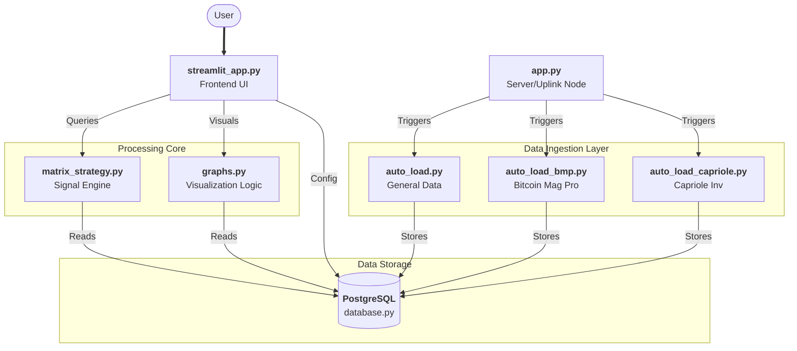
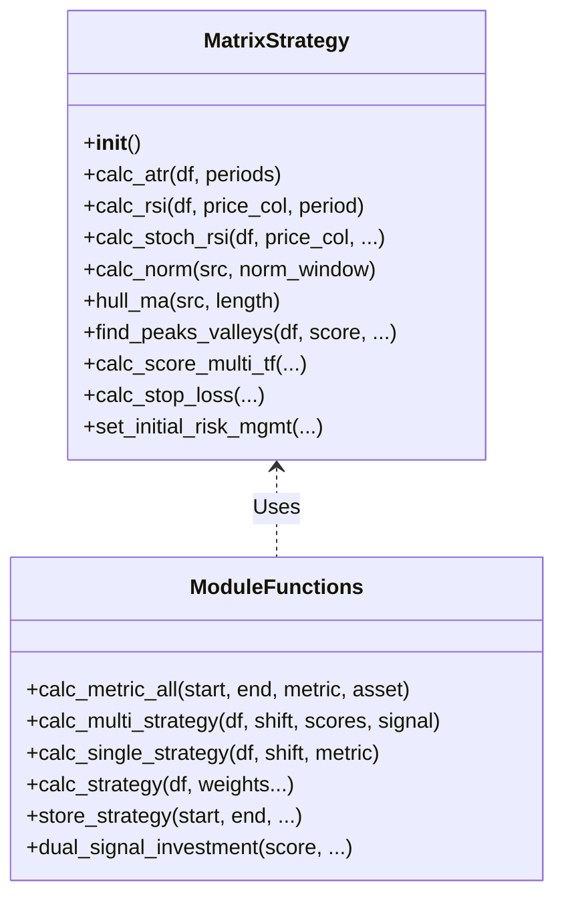
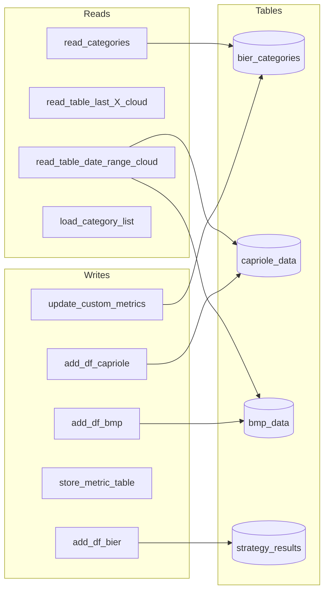

# BIER Strategy Dashboard - CodeWiki

## 1. System Overview

The **BIER Strategy Dashboard** is an advanced crypto-trading analysis platform designed to aggregate multi-source market data (on-chain, sentiment, macro), apply complex strategy logic (`matrix_strategy`), and visualize the results via a Streamlit interface. The system leverages a PostgreSQL database for persistence and Anvil Uplink for remote server orchestration.

---

## 2. High-Level Architecture

The system follows a modular architecture separating data ingestion, storage, processing, and presentation.

---

## 3. Module Detail & Function Maps

### 3.1 Strategy Engine: `matrix_strategy.py`

This module contains the core trading logic. It encapsulates signal processing, indicator calculation, and strategy execution.

#### Class Structure & Key Functions

**Key Function Descriptions:**

*   **`calc_metric_all(start_date, end_date, metric, asset)`**: The main entry point for the dashboard. It fetches raw price data (OHLC), computes the requested metric (or all metrics), applies normalization, and prepares the dataframe for strategy simulation.
*   **`calc_multi_strategy(df, peak_shift, scores_list, use_signal)`**: Aggregates multiple normalized metrics into a single "invest_score". It then applies `peaks` and `valleys` logic to generate buy/sell signals based on this composite score.
*   **`store_strategy(...)`**: Batch processing function to calculate and save strategy results to CSV/Database for historical analysis.
*   **`calc_norm(src, norm_window)`**: Normalizes any input series (metric) to a 0-100 scale, often using a lookback window (e.g., 4-year cycle) to ensure historical comparability.

---

### 3.2 Data Ingestion Layer

These modules handle fetching data from external APIs and normalizing it for the database.

#### `auto_load.py` (General & Manager)
*   **`auto_import_all_data()`**: Master function to trigger all sub-loaders.
*   **`auto_import_itc_data()`**: Fetches "Into The Cryptoverse" risk metrics.
*   **`auto_import_augmento_data()`**: Scrapes Augmento sentiment data.
*   **`store_bier_result(...)`**: Calculates and stores the final "BIER" strategy result.

#### `auto_load_bmp.py` (Bitcoin Magazine Pro)
Authenticates with BMP, fetches chart data, and parses proprietary JSON responses.
*   **`auto_import_bmp_data()`**: Orchestrator that iterates through defined metrics (e.g., `liquidity`, `mvrv`, `funding_rate`), fetches them, merges them into a master dataframe, and saves to DB.
*   **`query_bmp_metric(session, metric)`**: Low-level fetcher. Handles different payload structures for specific charts (e.g., Funding Rate vs. Fear & Greed).

#### `auto_load_capriole.py` (Capriole Investments)
Handles complex signed URL authentication for Capriole's API.
*   **`auto_import_capriole_data()`**: Main runner. Fetches metrics like `macro_index`, `production_cost`, `heater`.
*   **`query_capriole_metric(metric)`**: Uses hardcoded (but periodically updated) signed URLs to fetch protected data.

---

### 3.3 Database Interface: `database.py`

Centralized CRUD (Create, Read, Update, Delete) operations for PostgreSQL.

*   **`read_table_date_range_cloud(table, start, end)`**: Generic fetcher for time-series data.
*   **`store_metric_table(df, table_name)`**: Robust data saver. Handles duplicate checking, updates existing rows, or appends new data.
*   **`update_custom_metrics(metrics_list)`**: Updates the `bier_categories` table to flag which metrics are selected for the "Custom" strategy view.

---

### 3.4 Visualization: `graphs.py`

Generates Plotly JSON objects for the Streamlit frontend. Decoupling this allows `streamlit_app.py` to remain clean.

*   **`update_price_chart(...)`**: Creates the main candlestick chart overlaid with Buy/Sell signals (Green/Red background zones).
*   **`update_category_chart(...)`**: Visualizes the cumulative contribution of different categories (Macro, On-Chain, etc.) to the total score.
*   **`update_norm_chart(...)`**: Shows the normalized (0-100) values of individual metrics for deep-dive analysis.
*   **`update_signal_chart(...)`**: A complex multi-row chart showing exactly when each individual metric triggered a signal.

---

### 3.5 Frontend: `streamlit_app.py`

The user interface layer.

**Primary Flow:**
1.  **Initialization**: `st.set_page_config`, load CSS.
2.  **Sidebar**:
    *   Date Picker (`start_date`, `end_date`)
    *   Category Selector (`category_sel`) -> "Custom" triggers `database.get_all_metrics()`.
3.  **Data Loading**: 
    *   Calls `load_and_process_data()`, which wraps `matrix_strategy.calc_metric_all`.
    *   If "Custom" is selected, it dynamically modifies the strategy config before calculation.
4.  **Performance Calc**:
    *   `calc_performance(df)`: Computes Equity Curve, Drawdowns, Sharpe/Sortino Ratios for both Strategy and Buy & Hold.
5.  **Rendering**:
    *   **KPI Row**: 5 columns displaying key stats (Return, DD, Ratios).
    *   **Tabs**:
        *   *Tab 1*: Price Chart, Radar Chart (Regime Health), Equity Curve, Drawdown.
        *   *Tab 2*: Category contributions & Raw Metric data.
        *   *Tab 3*: Detailed Signal inspection.

---

## 4. File Output Locations

The system is configured to organize outputs cleanly:

*   **CSV Outputs**: All intermediate CSV files are saved to the `/data` directory (e.g., `/data/strategy.csv`, `/data/capriole_data.csv`).
*   **Database**: Persistent storage in the connected PostgreSQL instance.
